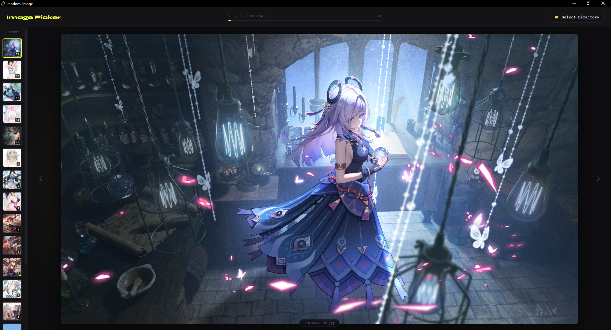

# 🎲 Random Image (Anime Picker)

A simple desktop application to randomly pick anime images. Built with Tauri for a lightweight and fast experience.

## 🚀 Features
- 🎴 Random anime image generator
- ⚡ Lightweight desktop app using Tauri
- 🖥️ Fast startup and minimal resource usage

## 📸 Preview



## 📦 Installation

Clone this repository:

```bash
git clone https://github.com/thea725/random-image.git
cd random-image
```

Install dependencies:

```bash
npm install
```

🛠️ Development

Run the app in development mode:

```bash
npm run tauri dev
```

📦 Build

Build the application for production:

```bash
npm run tauri build
```

📁 Tech Stack
Tauri
Node.js
JavaScript
⚠️ Prerequisites

Make sure you have the following installed:

Node.js
Rust (required by Tauri)
Tauri system dependencies (depending on your OS)

You can follow the official Tauri setup guide for detailed instructions.

⭐ Support

If you find this project useful or interesting, consider giving it a star ⭐
It helps the project grow and reach more people.

📜 License

MIT License